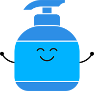
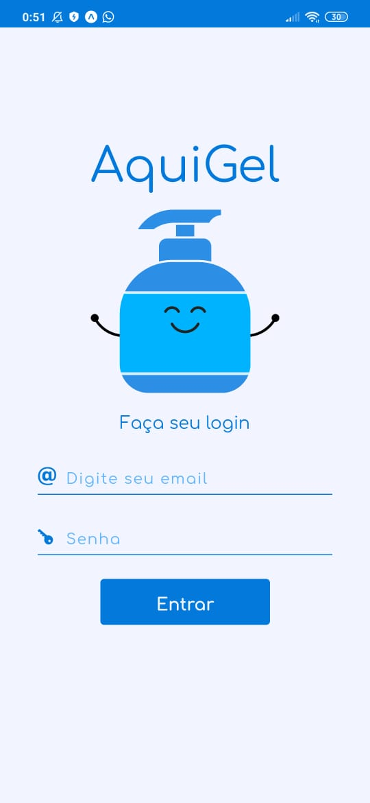
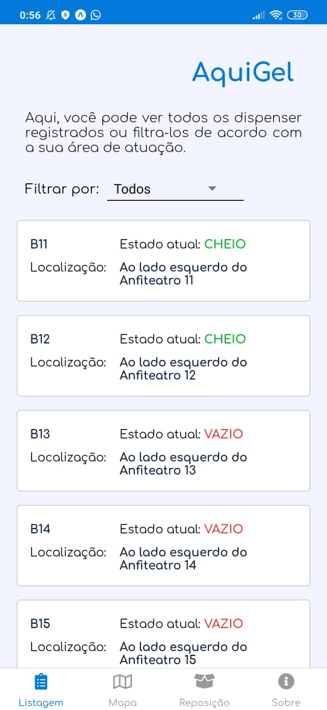
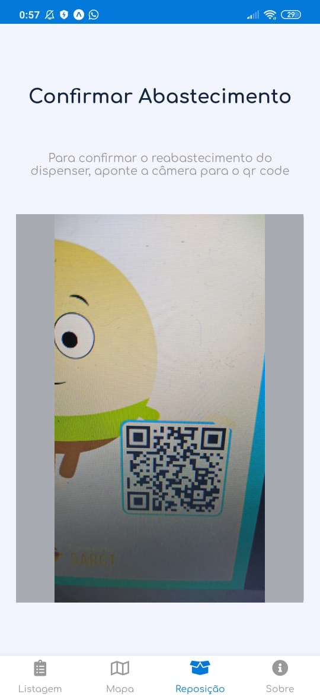
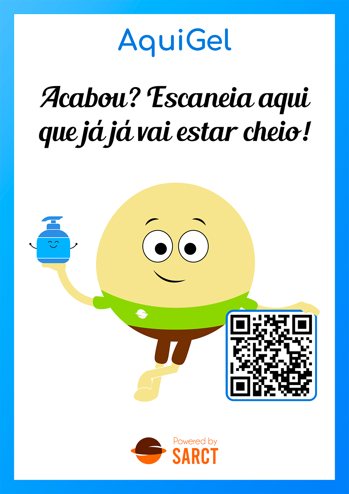
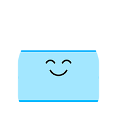

<div align="center">
  
</div>

<p align="center">
    
</p>
<p align="center">
  <a href="#rodando-o-projeto-localmente">Rodando o projeto localmente</a>&nbsp;&nbsp;&nbsp;|&nbsp;&nbsp;&nbsp;
  <a href="#tecnologias-utilizadas">Tecnologias</a>&nbsp;&nbsp;&nbsp;|&nbsp;&nbsp;&nbsp;
  <a href="#autores">Autores</a>
</p>

<div align="center">
  
</div>

<div align="center">
<div>


</div>

O "AquiGel" é um projeto idealizado e produzido pela equipe Sarct durante a maratona de inovação Covidas UnB.

A Maratona Covidas UnB é um evento voltado para o desenvolvimento de soluções para a retomada das atividades universitárias no contexto da pandemia da COVID-19.

Devido a pandemia da COVID-19, surgiu a necessidade do isolamento social como medida de contenção do vírus. Esse isolamento levou a suspensão das atividades acadêmicas presenciais na Universidade de Brasília.

Para proteger a si mesmo e as pessoas ao nosso redor, foram adotados alguns hábitos de prevenção. Dentre as precauções aconselhadas pela Organização Mundial de Saúde, está a frequente higienização das mãos com sabão ou de gel à base de álcool, prática esta que deverá ser aderida pela comunidade acadêmica quando retornarmos às aulas presenciais.

Com a crescente demanda de álcool gel, será fundamental a instalação de dispensers com o produto pelos câmpus. Com um grande número de dispensers, surge a dificuldade de mantê-los abastecidos, pois é difícil manter o controle de quais dispensers esvaziaram e quais ainda estão abastecidos. Além da dificuldade de manter esse controle, existe a falta de funcionários terceirizados que possam assumir a tarefa de reabastecimento dos dispensers, visto que a Universidade vem reduzindo gastos que impactam no contingente de auxiliares de limpeza de modo que este seja menor que o necessário.

Utilizando das tecnologias digitais, desenvolvemos o AquiGel, um sistema de gerenciamento do álcool gel em dispensers que possui como objetivo, mantê-los sempre abastecidos.

Ao lado de cada dispenser será instalado uma plaquinha com um QR Code. Quando uma pessoa tentar passar o álcool gel, caso este esteja vazio, basta apontar o câmera do celular para o QR Code e pronto, a informação de que o dispenser está vazio será enviada para o nosso sistema.

<div align="center">
  
</div>

O AquiGel é um aplicativo híbrido, ou seja, possui uma versão Web e uma Mobile. A versão Web será uma central e estará à disposição da equipe de limpeza, os responsáveis pelo reabastecimento. Nesta aplicação, será possível alterar o status de cada um dos dispensers para cheio conforme um auxiliar de limpeza faça a reposição.

A aplicação mobile do nosso sistema será disponibilizada para os auxiliares de limpeza que poderão facilmente em seu smartphone, observar em um mapa, quais os dispensers estão necessitando reabastecimento. Também terão a sua disposição, um scanner dentro do aplicativo, onde ao reabastecer, o mesmo poderá ler o QR Code ao lado do dispenser e confirmar o reabastecimento, atualizando o status para cheio em nosso sistema.

Além dos auxiliares de limpeza, também terão acesso a aplicação mobile, qualquer indivíduo que queira se voluntariar para ajudar na reposição dos dispensers. Após se cadastrarem no aplicativo, assim como os auxiliares, basta ver no mapa, quais os dispensers necessitam de reabastecimento. Esperamos também utilizar os balcões de informações que já estão estrategicamente posicionados ao longos dos prédios como postos de distribuição de refis. Utilizando o aplicativo, basta o usuário escanear o QR Code neste posto e pegar um refil. Então, basta se dirigir a um dispenser que se encontra vazio, reabastecê-lo, ler o QR Code ao lado do dispenser e confirmar o reabastecimento, atualizando o status para cheio em nosso sistema.

Nosso objetivo é garantir que hajam os meios para disponibilização do álcool em gel garantindo assim a higienização das mãos, além de impactar positivamente a economia, já que o trabalho voluntário reduziria o gasto com funcionários terceirizados e por fim promover um sentimento de zelo e de apreço com a universidade, permitindo que a própria comunidade cuide do seu ambiente de estudo.

Assim, surgiu o AquiGel =)



## Rodando o projeto localmente

### Pré requisitos

Para executar o software localmente, são necessárias as seguintes ferramentas:

<li>
<a href="https://expo.io/tools#cli">expo</a>
</li>
<li>
  <a href="https://yarnpkg.com/getting-started/install#global-install">yarn</a>
</li>
<li>
<a href="https://docs.docker.com/engine/examples/postgresql_service/">Docker</a>
</li>

### Instalação

### 1 - Baixe o repositório

```bash
git clone https://github.com/COVIDAS-UnB/Sarct.git
```

### 2 - Entre na pasta do projeto

```
cd Sarct
```

### 3 - Instale as dependências

```
cd server
yarn
```

```
cd mobile
yarn
```

```
cd web
yarn
```

### 4 -Configurar o ambiente do backend

Configuração das variáveis de ambiente do banco de dados postgress:

```
DB_HOST=localhost
DB_USER={ USUÁRIO DO BANCO DE DADOS}
DB_PASS={ SENHA DO BANCO DE DADOS}
DB_NAME={ NOME DO BANCO DE DADOS}
```

### 5 -Configurar o ambiente do mobile

Configuração do arquivo mobile/.env
O API_URL é igual ao do expo porém sem a porta
Ex.: 192.168.0.XX

```
API_URL= ''
```

### 6 - Execute o backend

```
cd server
yarn run dev
```

### 7 - Execute o mobile

```
cd mobile
yarn start
```

### 8 - Execute o site

```
cd web
yarn start
```

## Tecnologias utilizadas

- [Express](https://expressjs.com/) - Framework utilizado no backend
- [Sequelize](https://sequelize.org/) - ORM para consular o banco de dados postgres
- [React Native](https://reactnative.dev/) - Framework utilizado no frontent
- [Styled components](https://styled-components.com/) - Estilização de componentes no react native
- [Docker](https://www.docker.com/) - Conteinerização do postgreSQL

## Autores

- [Israel Santos](https://github.com/israelcarlos01)
- [João Magalhães](https://github.com/joaovictornm)
- [Matheus Alves](https://github.com/MSantosAlves)
- [Richard Viana](https://github.com/richardjlv)
- [Robson Melo](https://github.com/RobinhoRamon)

## Oque foi desenvolvido

Nosso projeto é dividido em 3 partes: Site, aplicativo mobile e o back end.

O aplicativo, foi feito para os voluntários e para os terceirizados que consigam utilizá-lo tornando a atualização de informações mais dinâmica. Nele já desenvolvemos a leitura do QR code e duas formas de visualização dos dispensers disponíveis no campus, uma através de uma lista contendo o estado do dispenser (cheio ou vazio) e um ponto de referência e a outra será um mapa da UnB, com as mesmas informações da lista porém com o ponto exato onde o dispenser está.

O site foi projetado para os postos de distribuição de refil e para a central de controle. Apesar de não estar integrado com o backend ele já possui as páginas referentes ao login, lista com todos os dispensers disponíveis e também de criar um novo ponto para um novo dispenser.
